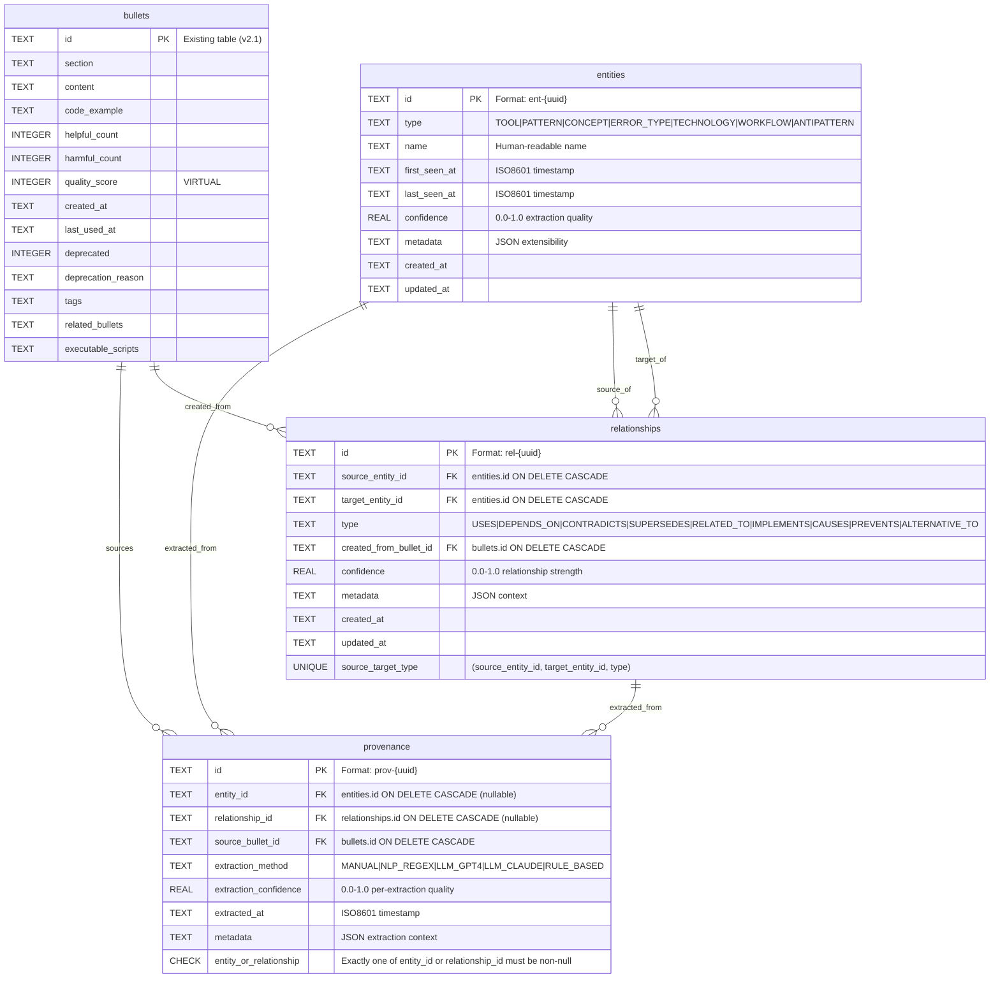
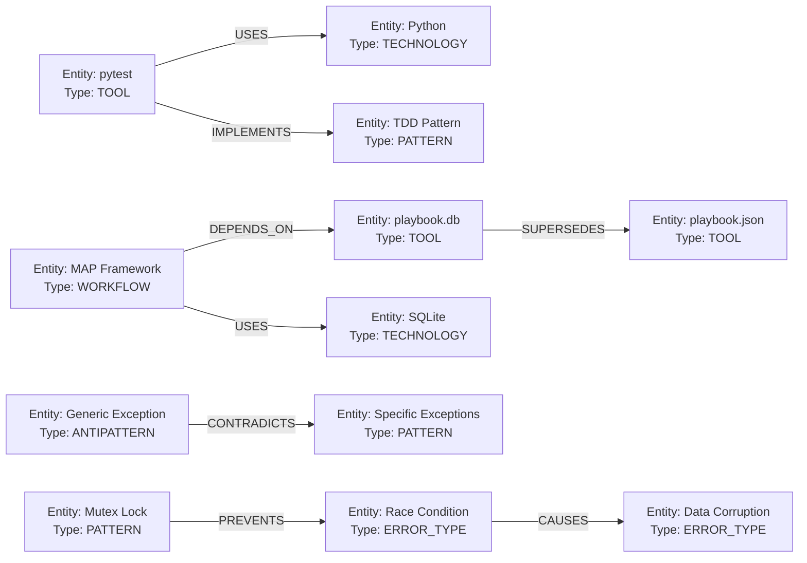

# Knowledge Graph Schema v3.0 - Entity-Relationship Diagram

## ERD Diagram (Mermaid)



## Table Relationships

### Core Relationships

1. **bullets → provenance**: One bullet → many provenance records (multiple entities/relationships extracted)
2. **entities → provenance**: One entity → many provenance records (mentioned in multiple bullets)
3. **relationships → provenance**: One relationship → many provenance records
4. **entities → relationships (source)**: One entity → many outgoing edges
5. **entities → relationships (target)**: One entity → many incoming edges
6. **bullets → relationships**: One bullet → many relationships mentioned

### Cardinality

- **1:N** (bullets to provenance)
- **1:N** (entities to provenance)
- **1:N** (relationships to provenance)
- **1:N** (entities to relationships as source)
- **1:N** (entities to relationships as target)
- **1:N** (bullets to relationships)

## Index Strategy

### Entities Table Indexes

```sql
idx_entities_type          -- Fast filtering by entity type (TOOL, PATTERN, etc.)
idx_entities_name          -- Case-insensitive name lookup
idx_entities_confidence    -- Quality-based filtering (DESC for top entities)
idx_entities_last_seen     -- Temporal queries (recent entities)
entities_fts               -- Full-text search on name + metadata
```

**Query patterns enabled:**
- "Find all TOOL entities" → `idx_entities_type`
- "Search for entity by name" → `idx_entities_name` or `entities_fts`
- "Show highest-confidence entities" → `idx_entities_confidence`
- "Recently mentioned entities" → `idx_entities_last_seen`

### Relationships Table Indexes

```sql
idx_rel_source             -- Graph traversal: find outgoing edges from entity X
idx_rel_target             -- Graph traversal: find incoming edges to entity Y
idx_rel_type               -- Filter by relationship type (e.g., all USES)
idx_rel_confidence         -- Quality-based filtering
idx_rel_bullet             -- Provenance: which relationships from bullet Z
idx_rel_bidirectional      -- Composite index for neighbor queries
```

**Query patterns enabled:**
- "What does entity X use?" → `idx_rel_source` with `type = 'USES'`
- "What uses entity Y?" → `idx_rel_target` with `type = 'USES'`
- "All dependencies" → `idx_rel_type` with `type = 'DEPENDS_ON'`
- "Neighbors of entity" → `idx_rel_bidirectional`

### Provenance Table Indexes

```sql
idx_prov_entity            -- Find all provenance for entity X
idx_prov_relationship      -- Find all provenance for relationship Y
idx_prov_bullet            -- Find all entities/relationships from bullet Z
idx_prov_method            -- Filter by extraction method
idx_prov_extracted_at      -- Temporal queries (recent extractions)
```

## Foreign Key Cascade Behavior

### ON DELETE CASCADE Rationale

1. **relationships.source_entity_id → entities.id**: Deleting entity removes outgoing edges (prevents orphaned edges)
2. **relationships.target_entity_id → entities.id**: Deleting entity removes incoming edges
3. **relationships.created_from_bullet_id → bullets.id**: Deleting bullet removes relationships created from it
4. **provenance.entity_id → entities.id**: Deleting entity removes its provenance records
5. **provenance.relationship_id → relationships.id**: Deleting relationship removes its provenance
6. **provenance.source_bullet_id → bullets.id**: Deleting bullet removes provenance records

### Why CASCADE instead of RESTRICT?

- **Simplifies cleanup**: Removing deprecated bullets automatically cleans graph
- **Maintains referential integrity**: No orphaned foreign keys
- **Aligns with playbook lifecycle**: When bullet removed, derived knowledge should be re-evaluated

**Trade-off**: Accidental bullet deletion removes graph knowledge. Mitigation: Add `deleted_at` soft-delete column in future.

## Data Integrity Constraints

### CHECK Constraints

1. **entities.type**: Must be one of 7 valid types
2. **entities.confidence**: Range [0.0, 1.0]
3. **relationships.type**: Must be one of 9 valid relationship types
4. **relationships.confidence**: Range [0.0, 1.0]
5. **provenance.extraction_method**: Must be one of 5 valid methods
6. **provenance.extraction_confidence**: Range [0.0, 1.0]
7. **provenance entity/relationship exclusivity**: Exactly one of `entity_id` or `relationship_id` must be non-null

### UNIQUE Constraints

1. **relationships(source_entity_id, target_entity_id, type)**: Prevents duplicate relationships
   - Example: "pytest USES Python" can only be recorded once
   - Different types allowed: "pytest USES Python" and "pytest DEPENDS_ON Python" both valid

## Schema Version Migration Path

```
v2.0 (bullets only)
  ↓
v2.1 (bullets + executable_scripts field)
  ↓
v3.0 (bullets + entities + relationships + provenance) ← This schema
```

**Migration approach** (applied in `playbook_manager.py._migrate_schema()`):

1. Check `metadata.schema_version`
2. If `2.1`, run migration:
   - Execute `schema_v3.0.sql` to add new tables
   - Update `metadata.schema_version = '3.0'`
   - Update `metadata.kg_enabled = '1'`
3. Migration is **idempotent**: Uses `CREATE TABLE IF NOT EXISTS`

## Example Graph Visualization



## Performance Characteristics

### Query Complexity

- **Point lookup** (entity by ID): O(1) with B-tree index
- **Type filtering** (all TOOLs): O(log N + K) where K = result count
- **1-hop traversal** (entity neighbors): O(log N + K) with indexes
- **N-hop traversal** (recursive CTE): O(E * N) where E = edges, N = hop count
- **Full-text search**: O(M) where M = matching documents (FTS5 optimized)

### Scalability Estimates

- **10K entities**: <1 MB (avg 100 bytes/entity)
- **50K relationships**: ~5 MB (avg 100 bytes/relationship)
- **100K provenance records**: ~10 MB
- **Total DB size**: ~16 MB (well within SQLite limits, queries remain fast)

## Validation Queries

Run these after migration to verify schema integrity:

```sql
-- 1. Verify all tables exist
SELECT name FROM sqlite_master WHERE type='table'
AND name IN ('entities', 'relationships', 'provenance');
-- Expected: 3 rows

-- 2. Verify all indexes exist
SELECT name FROM sqlite_master WHERE type='index'
AND name LIKE 'idx_%';
-- Expected: 15 indexes (4 entities + 6 relationships + 5 provenance)

-- 3. Verify foreign key enforcement
PRAGMA foreign_keys;
-- Expected: 1 (enabled)

-- 4. Verify schema version
SELECT value FROM metadata WHERE key = 'schema_version';
-- Expected: '3.0'

-- 5. Test CHECK constraint
INSERT INTO entities (id, type, name, first_seen_at, last_seen_at, created_at, updated_at)
VALUES ('test', 'INVALID_TYPE', 'Test', '2025-01-01T00:00:00Z', '2025-01-01T00:00:00Z', '2025-01-01T00:00:00Z', '2025-01-01T00:00:00Z');
-- Expected: CHECK constraint failed: entities.type
```
