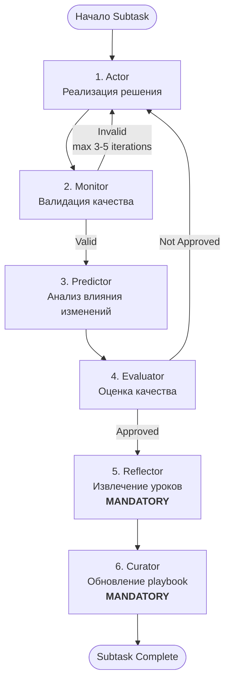

# Рабочий Процесс MAP Framework

## Обзор Workflow

MAP Framework использует **строго последовательную 6-агентную оркестрацию** для каждой подзадачи (subtask).

**Обязательная последовательность:**



## Slash-команды Orchestrator

MAP предоставляет **4 специализированных workflow команды** для различных сценариев:

1. **`/map-feature`** — реализация новых функций
2. **`/map-debug`** — отладка проблем
3. **`/map-refactor`** — рефакторинг кода
4. **`/map-review`** — review документации

**Orchestrator** — НЕ отдельный агент-шаблон, а логика координации, реализованная в этих slash-командах.

## Критические Правила Enforcement

### Правило 1: Обязательный вызов Reflector

**ЗАПРЕЩЕНО:**

- ❌ "Проанализировать успех вручную" и написать уроки
- ❌ "Пропустить Reflector для простых задач"
- ❌ "Вручную создать playbook bullets"

**ОБЯЗАТЕЛЬНО:**

- ✅ Вызвать `Task(subagent_type="reflector", ...)`
- ✅ Верифицировать использование `cipher_memory_search` в output
- ✅ Позволить Reflector извлечь паттерны из agent outputs

**Почему:** Шаблон Reflector содержит инструкции по поиску в cipher. При ручной работе `cipher_memory_search` не вызывается → дублируется knowledge.

### Правило 2: Обязательный вызов Curator

**ЗАПРЕЩЕНО:**

- ❌ "Применить Reflector insights к playbook самостоятельно"
- ❌ "Вручную редактировать `.claude/playbook.json`"
- ❌ "Пропустить обновление playbook для мелких изменений"

**ОБЯЗАТЕЛЬНО:**

- ✅ Вызвать `Task(subagent_type="curator", ...)`
- ✅ Верифицировать использование `cipher_memory_search` для дедупликации
- ✅ Применить delta операции Curator (ADD/UPDATE/DEPRECATE)
- ✅ Вызвать `cipher_extract_and_operate_memory` если есть `sync_to_cipher` записи

**Почему:** Шаблон Curator содержит инструкции по проверке cipher на дубликаты ПЕРЕД добавлением bullets И по синхронизации high-quality bullets (helpful_count >= 5) обратно в cipher.

### Правило 3: Верификация MCP Tool Usage

После вызова Reflector или Curator, orchestrator **ПРОВЕРЯЕТ** использование MCP tools:

**Reflector Output должен показывать:**

- Ссылки на вызов `cipher_memory_search` (tool logs, JSON, или narrative text с результатами поиска)
- Подтверждение, что результаты поиска учтены в reasoning (формулировка может варьироваться)

**Curator Output должен показывать:**

- Reasoning о deduplication через `cipher_memory_search`
- Массив `sync_to_cipher` **только когда** bullets достигли helpful_count ≥ 5 (может отсутствовать или быть пустым)

**Если отсутствует:** Агент пропустил обязательные MCP calls → исследовать причину (skip tools, mis-report, template updates).

## Dual Memory System

MAP использует **ДВЕ системы хранения знаний**:

### 1. Playbook (Проектная Memory)

- **Локация:** `.claude/playbook.json`
- **Назначение:** Структурированные, категоризованные паттерны для ЭТОГО проекта
- **Формат:** Bullets с примерами кода, тегами, helpful/harmful counts
- **Scope:** Один проект

### 2. Cipher (Кросс-проектная Memory)

- **Локация:** MCP tool (внешняя семантическая БД)
- **Назначение:** Общее knowledge для ВСЕХ проектов
- **Формат:** Semantic embeddings для similarity search
- **Scope:** Все проекты, использующие cipher

**Интеграция:**

- Reflector ищет в cipher похожие паттерны ПЕРЕД анализом
- Curator проверяет cipher на дубликаты ПЕРЕД добавлением bullets
- Curator синхронизирует high-quality bullets (helpful_count >= 5) обратно в cipher

## Recitation Pattern — Context Engineering

**Проблема:** На длинных задачах (8+ subtasks, 50K+ tokens) модель "теряет нить" и забывает исходную цель.

**Решение:** **Recitation Pattern** — держит общую цель и прогресс "свежими" в context window.

### RecitationManager

**Файлы:**

- `.map/current_plan.md` — human-readable progress tracker
- `.map/current_plan.json` — machine-readable state

**Жизненный цикл:**

1. **Step 2.5:** **Orchestrator** после TaskDecomposer создаёт plan

   ```bash
   mapify recitation create "$TASK_ID" "$ARGUMENTS" "$SUBTASKS_JSON"
   ```

2. **Step 3.1.5:** **Orchestrator** перед КАЖДЫМ Actor invocation обновляет статус

   ```bash
   mapify recitation update <subtask_id> in_progress
   PLAN_CONTEXT=$(mapify recitation get-context)
   ```

3. **Actor Template:** Получает `{{plan_context}}` через Handlebars variable в секции `<recitation_plan>`
4. **После завершения:** Cleanup удаляет `.map/` директорию

   ```bash
   mapify recitation clear
   ```

**Progress Markers:**

- `[✓]` = completed
- `[→]` = in_progress (текущая задача)
- `[☐]` = pending
- `[✗]` = failed

**Интеграция с ошибками:**

- При Monitor rejection: план обновляется с номером retry attempt
- Дисплей: "⚠️ Retry attempt 2 - review previous errors"
- Реализует паттерны `qual-0001` (WHAT/WHERE/HOW/WHY) и `arch-0005` (three-failure threshold)

**Источник:** `CONTEXT-ENGINEERING-IMPROVEMENTS.md` Phase 1.1 (lines 276-289), `.claude/commands/map-feature.md` lines 61-103

## Actor-Monitor Retry Loop

**Механизм:**

- Monitor валидирует Actor output на качество, безопасность, корректность
- **IF invalid:** feedback → Actor (повторная реализация)
- **Лимит:** максимум 3-5 итераций
- **Эскалация:** Если 3 провала → escalate to user

**Flow:**

```bash
Actor → Monitor (iteration 1)
  IF invalid: Actor → Monitor (iteration 2)
    IF invalid: Actor → Monitor (iteration 3)
      IF invalid: ESCALATE TO USER
  IF valid: → Predictor
```

**Гейт:** "You can ONLY reach this step if Monitor returned valid: true"

## MCP Integration в Workflow

MAP использует **6 core MCP tools** для расширения возможностей workflow:

1. **`cipher_memory_search`** — поиск похожих паттернов в семантической базе
2. **`cipher_extract_and_operate_memory`** — сохранение успешных паттернов
3. **`sequential-thinking`** — сложные цепочки рассуждений
4. **`context7 (resolve-library-id + get-library-docs)`** — актуальная документация библиотек
5. **`deepwiki (read_wiki_structure + ask_question)`** — обучение на GitHub репозиториях
6. **`claude-reviewer (request_review)`** — профессиональный code review

## Self-Check Verification

Перед завершением любого MAP workflow subtask orchestrator **ОБЯЗАН** проверить 4 вопроса:

1. ❓ Вызвал ли я `Task(subagent_type="reflector", ...)` или извлекал уроки сам?
2. ❓ Вызвал ли я `Task(subagent_type="curator", ...)` или обновлял playbook сам?
3. ❓ Показал ли Reflector output, что он искал в cipher?
4. ❓ Показал ли Curator output операции `sync_to_cipher`?

**Нарушения:**

- Если "Сделал сам" на вопросы 1-2 → нарушение workflow, переделать subtask
- Если "Нет" на вопросы 3-4 → агенты не следовали шаблонам, исследовать причину

## Workflow Logger — Observability

**MapWorkflowLogger** — детальное логирование выполнения MAP workflows.

**Активация:** Логирование **опционально**, включается только при:

- CLI флаг: `--debug` (например, `mapify init --debug`)
- Переменная окружения: `MAP_DEBUG=true`

**Захватываемые события (7 типов):**

1. `workflow_start` — инициализация
2. `workflow_end` — завершение/провал
3. `agent_call` — каждый agent invocation
4. `tool_use` — MCP tool calls
5. `recitation_created` — создание plan
6. `recitation_updated` — изменения статуса plan
7. `error` — сбои workflow

**Формат:** JSON Lines (`.map/logs/workflow_TIMESTAMP.log`)

**Структура каждой строки:**

- `timestamp` (ISO 8601)
- `event_type` (из списка выше)
- `task_id` (корреляция с RecitationManager)
- `data` (event-specific payload)

**Использование:**

- Post-mortem debugging: какой агент вызывался? какие prompts отправлялись?
- Workflow replay: сохранить успешные логи как test fixtures
- Event correlation: task_id связывает events с `.map/current_plan.json`

## Context Engineering Optimizations

### Top-K Playbook Filtering

- **Конфигурация:** `.claude/playbook.json` → `metadata.top_k = 5`
- **Механизм:** При каждом subtask Actor получает только 5 наиболее релевантных bullets
- **Benefit:** С 25 bullets в базе, top-5 фильтрация предотвращает context distraction

### Принципы Context Engineering

1. **Append-Only Context** — НИКОГДА не редактируй предыдущие сообщения в истории (preserves KV-cache efficiency)
2. **External Storage as Context Extension** — `.map/current_plan.md` как внешняя память
3. **Focusing Attention ("Маяк" pattern)** — держит цели "свежими" в recent tokens через recitation

## Exception: Non-MAP Tasks

Эти правила **ТОЛЬКО** применяются при использовании MAP framework команд:

- `/map-feature`
- `/map-debug`
- `/map-refactor`
- `/map-review`

Для обычных задач (bug fixes, documentation, простые изменения) можно работать напрямую без полной agent chain.
