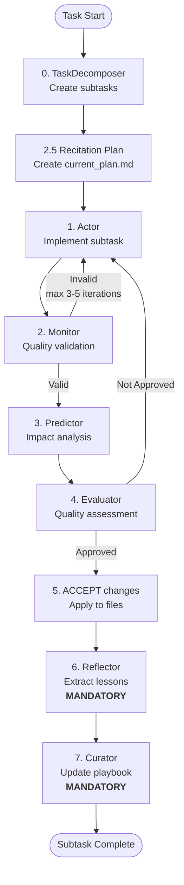

# MAP Framework Workflow

## Workflow Overview

MAP Framework uses a **strictly sequential orchestration** that begins with TaskDecomposer and then runs an implementation loop for each subtask.

**Mandatory sequence:**



## Orchestrator Slash Commands

MAP provides **4 specialized workflow commands** for different scenarios:

1. **`/map-feature`** — implement new features
2. **`/map-debug`** — debug issues
3. **`/map-refactor`** — refactor code
4. **`/map-review`** — review documentation

The **Orchestrator** is NOT a separate agent template; it is the coordination logic implemented in these slash commands.

## Critical Rules Enforcement

### Rule 1: Mandatory Reflector invocation

**PROHIBITED:**

- ❌ “Analyze success manually” and write lessons yourself
- ❌ “Skip Reflector for simple tasks”
- ❌ “Manually create playbook bullets”

**REQUIRED:**

- ✅ Call `Task(subagent_type="reflector", ...)`
- ✅ Verify `mcp__mem0__map_tiered_search` usage in the output
- ✅ Let Reflector extract patterns from agent outputs

**Why:** The Reflector template contains instructions to search cipher. Manual work won’t call `mcp__mem0__map_tiered_search` → knowledge gets duplicated.

### Rule 2: Mandatory Curator invocation

**PROHIBITED:**

- ❌ “Apply Reflector insights to playbook yourself”
- ❌ “Edit `.claude/mem0 MCP` manually”
- ❌ “Skip playbook updates for small changes”

**REQUIRED:**

- ✅ Call `Task(subagent_type="curator", ...)`
- ✅ Verify `mcp__mem0__map_tiered_search` is used for deduplication
- ✅ Apply Curator delta operations (ADD/UPDATE/DEPRECATE)
- ✅ Call `cipher_extract_and_operate_memory` if there are `sync_to_cipher` entries

**Why:** The Curator template enforces searching cipher BEFORE adding bullets AND syncing high-quality bullets (helpful_count ≥ 5) back to cipher.

### Rule 3: Verify MCP Tool Usage

After invoking Reflector or Curator, the orchestrator **MUST VERIFY** MCP tool usage:

**Reflector output must show:**

- Evidence of `mcp__mem0__map_tiered_search` calls (tool logs, JSON, or narrative with search results)
- Confirmation that search results informed the reasoning (phrasing may vary)

**Curator output must show:**

- Reasoning about deduplication via `mcp__mem0__map_tiered_search`
- An array `sync_to_cipher` only when bullets reached helpful_count ≥ 5 (may be missing or empty)

**If missing:** The agent skipped mandatory MCP calls → investigate (skip tools, mis-reporting, template updates).

## Dual Memory System

MAP uses **TWO knowledge storage systems**:

### 1. Playbook (Project Memory)

- **Location:** `.claude/mem0 MCP`
- **Purpose:** Structured, categorized patterns for THIS project
- **Format:** Bullets with code examples, tags, helpful/harmful counts
- **Scope:** Single project

### 2. Cipher (Cross-project Memory)

- **Location:** MCP tool (external)
- **Purpose:** Cross-project knowledge consolidation and reuse
- **Flow:** Reflector extracts → Curator deduplicates and applies → high-quality bullets synced to cipher

## Recitation Pattern — Context Engineering

**Mechanism:**

1. **Step 2.5:** **Orchestrator** creates a recitation plan after TaskDecomposer

   ```bash
   mapify recitation create "$TASK_ID" "$ARGUMENTS" "$SUBTASKS_JSON"
   ```

2. **Step 3.1.5:** **Orchestrator** updates status BEFORE EACH Actor invocation

   ```bash
   mapify recitation update <subtask_id> in_progress
   PLAN_CONTEXT=$(mapify recitation get-context)
   ```

3. **Actor Template:** Receives `{{plan_context}}` via Handlebars in the `<recitation_plan>` section
4. **After completion:** Cleanup removes the `.map/` directory

   ```bash
   mapify recitation clear
   ```

**Progress markers:**

- `[✓]` = completed
- `[→]` = in_progress (current task)
- `[☐]` = pending
- `[✗]` = failed

**Error integration:**

- On Monitor rejection: plan updates with retry attempt number
- Display: “⚠️ Retry attempt 2 — review previous errors”
- Implements patterns `qual-0001` (WHAT/WHERE/HOW/WHY) and `arch-0005` (three-failure threshold)

**Sources:** `CONTEXT-ENGINEERING-IMPROVEMENTS.md` Phase 1.1 (lines 276–289), `.claude/commands/map-feature.md` lines 61–103

## Actor–Monitor Retry Loop

**Mechanism:**

- Monitor validates Actor output for quality, safety, and correctness
- **IF invalid:** feedback → Actor (re-implementation)
- **Limit:** maximum 3–5 iterations
- **Escalation:** On 3 failures → escalate to user

**Flow:**

```bash
Actor → Monitor (iteration 1)
  IF invalid: Actor → Monitor (iteration 2)
    IF invalid: Actor → Monitor (iteration 3)
      IF invalid: ESCALATE TO USER
  IF valid: → Predictor
```

**Gate:** “You can ONLY reach this step if Monitor returned valid: true”

## MCP Integration in Workflow

MAP uses **6 core MCP tools** to extend workflow capabilities:

1. **`mcp__mem0__map_tiered_search`** — search similar patterns in a semantic memory base
2. **`cipher_extract_and_operate_memory`** — persist successful patterns
3. **`sequential-thinking`** — complex chains of reasoning
4. **`context7 (resolve-library-id + get-library-docs)`** — up-to-date library documentation
5. **`deepwiki (read_wiki_structure + ask_question)`** — learn from GitHub repositories
6. **`claude-reviewer (request_review)`** — professional code review

## Self-Check Verification

Before completing any MAP workflow subtask the orchestrator **MUST** check 4 questions:

1. ❓ Did I call `Task(subagent_type="reflector", ...)` or “learn” manually?
2. ❓ Did I call `Task(subagent_type="curator", ...)` or update the playbook manually?
3. ❓ Did the Reflector output show that it searched cipher?
4. ❓ Did the Curator output include `sync_to_cipher` operations?

**Violations:**

- If “Did it myself” on 1–2 → workflow violation; redo the subtask
- If “No” on 3–4 → agents didn’t follow templates; investigate

## Workflow Logger — Observability

**MapWorkflowLogger** — detailed logging of MAP workflows.

**Activation:** Logging is optional and enabled via:

- CLI flag: `--debug` (e.g., `mapify init --debug`, `mapify check --debug`)
- Environment variable: `MAP_DEBUG=true`

**Actual event names:**

- `session_start`, `session_end`
- `agent_invocation`
- `error`, `timing`
- `recitation_plan_created`, `recitation_subtask_updated`, `recitation_context_retrieved`
- Custom events via `log_event` (e.g., `command_start`)

**Format:** JSON Lines (`.map/logs/workflow_TIMESTAMP.log`)

**Each line includes:**

- `timestamp` (ISO 8601)
- `event` (event name)
- `task_id` (correlates with RecitationManager)
- Event-specific fields (e.g., `prompt_preview`, `response_preview` for agent_invocation)

**Usage:**

- Post-mortem debugging: which agent was called? what prompts were sent?
- Workflow replay: save successful logs as test fixtures
- Event correlation: `task_id` ties events to `.map/current_plan.json`

## Context Engineering Optimizations

### Top-K Playbook Filtering

- **Config:** `.claude/mem0 MCP` → `metadata.top_k = 5`
- **Mechanism:** For every subtask, Actor receives only the 5 most relevant bullets
- **Benefit:** With 25 bullets total, top-5 filtering prevents context distraction

### Principles of Context Engineering

1. **Append-Only Context** — NEVER edit previous messages in history (preserves KV-cache efficiency)
2. **External Storage as Context Extension** — `.map/current_plan.md` as external memory
3. **Focusing Attention (“Beacon” pattern)** — keeps goals “fresh” in recent tokens via recitation

## Exception: Non-MAP Tasks

These rules apply **ONLY** when using MAP framework commands:

- `/map-feature`
- `/map-debug`
- `/map-refactor`
- `/map-review`

For ordinary tasks (bug fixes, docs, simple changes) you can work directly without the full agent chain.
