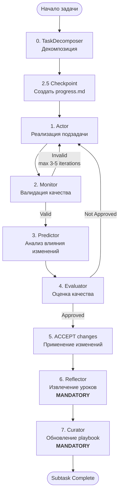

# Рабочий Процесс MAP Framework

## Обзор Workflow

MAP Framework использует **строго последовательную оркестрацию**, которая начинается с TaskDecomposer, после чего для каждой подзадачи запускается цикл реализации.

**Обязательная последовательность:**



## Slash-команды Orchestrator

MAP предоставляет **10 workflow команд** для различных сценариев:

**Основные workflows:**
1. **`/map-efficient`** — реализация фичей, рефакторинг, сложные задачи (рекомендуемый по умолчанию)
2. **`/map-debug`** — отладка проблем, исправление багов
3. **`/map-fast`** — небольшие низкорисковые изменения
4. **`/map-debate`** — мульти-вариантный синтез с Opus арбитром

**Вспомогательные команды:**
5. **`/map-review`** — review изменений перед коммитом
6. **`/map-check`** — quality gates и верификация
7. **`/map-plan`** — только архитектурная декомпозиция
8. **`/map-release`** — release workflow с валидационными гейтами
9. **`/map-resume`** — возобновление прерванных workflows
10. **`/map-learn`** — извлечение и сохранение уроков (опциональный шаг)

**Orchestrator** — НЕ отдельный агент-шаблон, а логика координации, реализованная в этих slash-командах.

## Критические Правила Enforcement

### Правило 1: Обязательный вызов Reflector

**ЗАПРЕЩЕНО:**

- ❌ "Проанализировать успех вручную" и написать уроки
- ❌ "Пропустить Reflector для простых задач"
- ❌ "Вручную создать playbook bullets"

**ОБЯЗАТЕЛЬНО:**

- ✅ Вызвать `Task(subagent_type="reflector", ...)`
- ✅ Верифицировать использование `mcp__mem0__map_tiered_search` в output
- ✅ Позволить Reflector извлечь паттерны из agent outputs

**Почему:** Шаблон Reflector содержит инструкции по поиску существующих паттернов. При ручной работе `mcp__mem0__map_tiered_search` не вызывается → дублируется knowledge.

### Правило 2: Обязательный вызов Curator

**ЗАПРЕЩЕНО:**

- ❌ "Применить Reflector insights к playbook самостоятельно"
- ❌ "Вручную редактировать `.claude/mem0 MCP`"
- ❌ "Пропустить обновление playbook для мелких изменений"

**ОБЯЗАТЕЛЬНО:**

- ✅ Вызвать `Task(subagent_type="curator", ...)`
- ✅ Верифицировать использование `mcp__mem0__map_tiered_search` для дедупликации
- ✅ Применить delta операции Curator (ADD/UPDATE/DEPRECATE)
**Почему:** Шаблон Curator содержит инструкции по проверке на дубликаты ПЕРЕД добавлением bullets.

### Правило 3: Верификация MCP Tool Usage

После вызова Reflector или Curator, orchestrator **ПРОВЕРЯЕТ** использование MCP tools:

**Reflector Output должен показывать:**

- Ссылки на вызов `mcp__mem0__map_tiered_search` (tool logs, JSON, или narrative text с результатами поиска)
- Подтверждение, что результаты поиска учтены в reasoning (формулировка может варьироваться)

**Curator Output должен показывать:**

- Reasoning о deduplication через `mcp__mem0__map_tiered_search`
**Если отсутствует:** Агент пропустил обязательные MCP calls → исследовать причину (skip tools, mis-report, template updates).

## Memory System

### Playbook (Проектная Memory)

- **Локация:** `.claude/mem0 MCP`
- **Назначение:** Структурированные, категоризованные паттерны для ЭТОГО проекта
- **Формат:** Bullets с примерами кода, тегами, helpful/harmful counts
- **Scope:** Один проект

## Recitation Pattern — Context Engineering

**Проблема:** На длинных задачах (8+ subtasks, 50K+ tokens) модель "теряет нить" и забывает исходную цель.

**Решение:** **Recitation Pattern** — держит общую цель и прогресс "свежими" в context window.

### RecitationManager

**Файлы:**

- `.map/progress.md` — workflow checkpoint (YAML frontmatter + markdown body)
- `.map/task_plan_*.md` — task decomposition with validation criteria

**Жизненный цикл:**

1. **Step 2.5:** **Orchestrator** после TaskDecomposer создаёт plan

   ```bash
   mapify recitation create "$TASK_ID" "$ARGUMENTS" "$SUBTASKS_JSON"
   ```

2. **Step 3.1.5:** **Orchestrator** перед КАЖДЫМ Actor invocation обновляет статус

   ```bash
   mapify recitation update <subtask_id> in_progress
   PLAN_CONTEXT=$(mapify recitation get-context)
   ```

3. **Actor Template:** Получает `{{plan_context}}` через Handlebars variable в секции `<recitation_plan>`
4. **После завершения:** Cleanup удаляет `.map/` директорию

   ```bash
   mapify recitation clear
   ```

**Progress Markers:**

- `[✓]` = completed
- `[→]` = in_progress (текущая задача)
- `[☐]` = pending
- `[✗]` = failed

**Интеграция с ошибками:**

- При Monitor rejection: план обновляется с номером retry attempt
- Дисплей: "⚠️ Retry attempt 2 - review previous errors"
- Реализует паттерны `qual-0001` (WHAT/WHERE/HOW/WHY) и `arch-0005` (three-failure threshold)

**Источник:** `CONTEXT-ENGINEERING-IMPROVEMENTS.md` Phase 1.1 (lines 276-289), `.claude/commands/map-efficient.md`

## Actor-Monitor Retry Loop

**Механизм:**

- Monitor валидирует Actor output на качество, безопасность, корректность
- **IF invalid:** feedback → Actor (повторная реализация)
- **Лимит:** максимум 3-5 итераций
- **Эскалация:** Если 3 провала → escalate to user

**Flow:**

```bash
Actor → Monitor (iteration 1)
  IF invalid: Actor → Monitor (iteration 2)
    IF invalid: Actor → Monitor (iteration 3)
      IF invalid: ESCALATE TO USER
  IF valid: → Predictor
```

**Гейт:** "You can ONLY reach this step if Monitor returned valid: true"

## MCP Integration в Workflow

MAP использует **5 core MCP tools** для расширения возможностей workflow:

1. **`mcp__mem0__map_tiered_search`** — поиск похожих паттернов в семантической базе
2. **`sequential-thinking`** — сложные цепочки рассуждений
3. **`context7 (resolve-library-id + get-library-docs)`** — актуальная документация библиотек
4. **`deepwiki (read_wiki_structure + ask_question)`** — обучение на GitHub репозиториях
5. **`claude-reviewer (request_review)`** — профессиональный code review

## Self-Check Verification

Перед завершением любого MAP workflow subtask orchestrator **ОБЯЗАН** проверить 2 вопроса:

1. ❓ Вызвал ли я `Task(subagent_type="reflector", ...)` или извлекал уроки сам?
2. ❓ Вызвал ли я `Task(subagent_type="curator", ...)` или обновлял playbook сам?

**Нарушения:**

- Если "Сделал сам" на вопросы 1-2 → нарушение workflow, переделать subtask

## Workflow Logger — Observability

**MapWorkflowLogger** — детальное логирование выполнения MAP workflows.

**Активация:** Логирование опционально и включается через:

- CLI флаг: `--debug` (например, `mapify init --debug`, `mapify check --debug`)
- Переменную окружения: `MAP_DEBUG=true`

**Фактические имена событий:**

- `session_start`, `session_end`
- `agent_invocation`
- `error`, `timing`
- `recitation_plan_created`, `recitation_subtask_updated`, `recitation_context_retrieved`
- Пользовательские события через `log_event` (например, `command_start`)

**Формат:** JSON Lines (`.map/logs/workflow_TIMESTAMP.log`)

**Структура строки:**

- `timestamp` (ISO 8601)
- `event` (имя события)
- `task_id` (корреляция с RecitationManager)
- Специфичные поля для события (например, `prompt_preview`, `response_preview` для agent_invocation)

**Использование:**

- Post-mortem debugging: какой агент вызывался? какие prompts отправлялись?
- Workflow replay: сохранить успешные логи как test fixtures
- Event correlation: task_id связывает events с `.map/current_plan.json`

## Context Engineering Optimizations

### Top-K Playbook Filtering

- **Конфигурация:** `.claude/mem0 MCP` → `metadata.top_k = 5`
- **Механизм:** При каждом subtask Actor получает только 5 наиболее релевантных bullets
- **Benefit:** С 25 bullets в базе, top-5 фильтрация предотвращает context distraction

### Принципы Context Engineering

1. **Append-Only Context** — НИКОГДА не редактируй предыдущие сообщения в истории (preserves KV-cache efficiency)
2. **External Storage as Context Extension** — `.map/progress.md` как внешняя память
3. **Focusing Attention ("Маяк" pattern)** — держит цели "свежими" в recent tokens через recitation

## Exception: Non-MAP Tasks

Эти правила **ТОЛЬКО** применяются при использовании MAP framework команд (`/map-efficient`, `/map-debug`, `/map-fast`, `/map-debate`, `/map-review`, `/map-check`, `/map-plan`, `/map-release`, `/map-resume`, `/map-learn`).

Для обычных задач (bug fixes, documentation, простые изменения) можно работать напрямую без полной agent chain.
